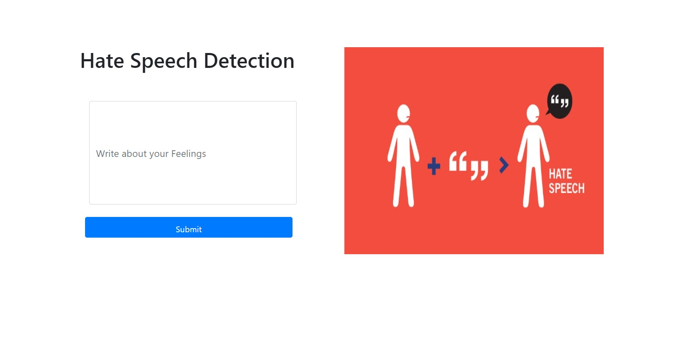
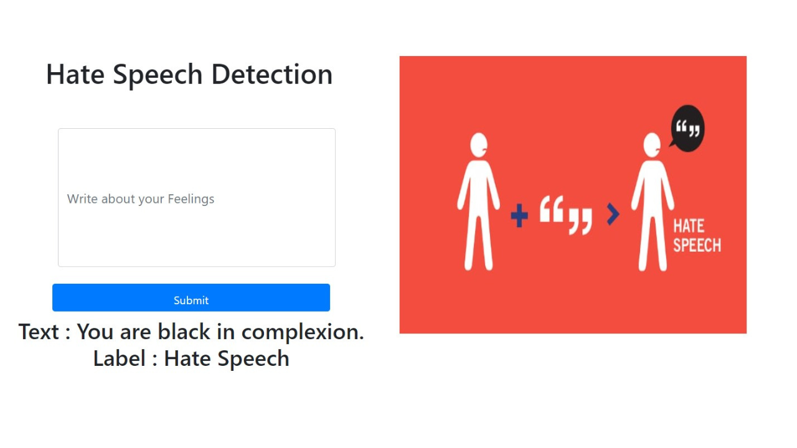
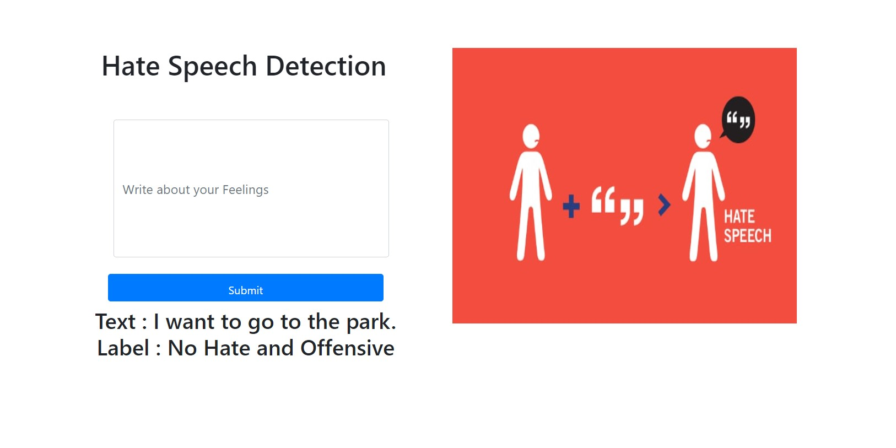

# Hate Speech Detection Web App
A web app that identifies hate speech in written text.

## Introduction
According to the Cambridge Dictionary, hate speech is described as "public speech that expresses hatred or promotes violence toward a person or group based on something such as race, religion, gender, color”. 

## Problem Statement
Hate speech becoming more prevalent on Social media platforms. It's getting worse and needs to be stopped from spreading. To do this, we can use machine learning algorithms to detect and block hate speech at the right moment.

## Dataset discussion
* Hate Speech and offensive language dataset.
* Contains tweets' text.
* Available on kaggle.
* 24783 rows
* 7 columns

## Web App
The implementation of the web app involves using Python, machine learning algorithms, and Flask framework.

## Hate Speech Detected

## No Hate and Offense Detected

## Demo Video Link
If you're curious about how our web app works, we've got you covered! Check out the demo video here: 
[Hate Speech Detection Video](https://www.youtube.com/watch?v=jdFQ80g9sWI)

## Deployed on PythonAnywhere
[Hate Speech Detection Web App Link](http://sidratulmuntahausmani.pythonanywhere.com/)

